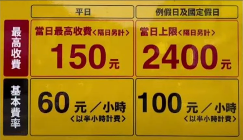

# 重構工作坊：停車場收費計算器

## 需求

貴到上新聞的停車場收費計算器

## 特別感謝

[Kuma 老師的軟體工程教室](https://www.youtube.com/@kukumamaya)
提供在[【「早知道就停紅線」- 用 TDD 寫出一個會上新聞的停車場收費計算器】](https://www.youtube.com/playlist?list=PLvBh-90IwbPKFUUFw1PTezAVQqi0PUhTB)
一系列影片中的測項，讓我得以產出可重構的醜程式碼。

## 授權聲明

此專案僅供工作坊內部實作練習使用，未經許可，請勿複製、散佈或公開修改此專案。
此專案的內容受版權保護，所有權利歸屬於 [Abi Chang](https://abichangtw.carrd.co).
